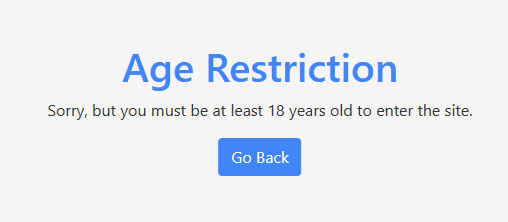

# Age Verification Page

This is an easily customizable page to redirect to after "No" on an age verification dialogue. You can customize it to fit your website's color scheme.

# Example

[https://chrismin13.github.io/AgeVerification/?origin=google.com&accent=4285F4&lang=en-US&age=18](https://chrismin13.github.io/AgeVerification/?origin=google.com&accent=4285F4&lang=en-US&age=18)



See it in action:

[Cava365](https://cava365.gr)

## Features

- **Dynamic Customization**: Customize the appearance, language, and age requirement of the age verification page via URL parameters.
- **Multi-Language Support**: Currently supports English (`en-US`) and Greek (`el-GR`), with the option to easily add more languages.
- **Accent Color Customization**: Adjust the accent color of the page to match your website's branding.
- **Customizable Age Requirement**: Set the age requirement dynamically via a URL parameter.

## How to Use

To use the age verification page, append the required query parameters to the URL:

```
https://chrismin13.github.io/AgeVerification/?origin=<your-site-domain>&accent=<accent-color>&lang=<language-code>&age=<age-requirement>
```

Replace the placeholders as follows:
- `<your-site-domain>`: The domain of your website (where users will return if they are over the age requirement).
- `<accent-color>`: The accent color for the page, without the `#` (e.g., `9C865B`).
- `<language-code>`: The language code (`en-US` for English, `el-GR` for Greek).
- `<age-requirement>` (Optional): The minimum age required to access the site (e.g., `18`, `21`).

## Customizing

### Adding New Languages

To add support for a new language, modify the `setLanguage` function within the `index.html` file. Add a new case to the `messages` object with the corresponding text for the new language, including placeholders for the dynamic age requirement.

### Adjusting Styles

To further customize the styles beyond the accent color, edit the CSS within the `index.html` file. Use custom classes and modify existing ones as needed to achieve the desired appearance.

## Contributing

Contributions are welcome! If you'd like to add more languages, adjust the age verification logic, or suggest other improvements, please feel free to fork the repository, make your changes, and submit a pull request.

## License and Disclaimers

This project is open-source and available under the [MIT License](LICENSE). ChatGPT was used for the creation of this website.
